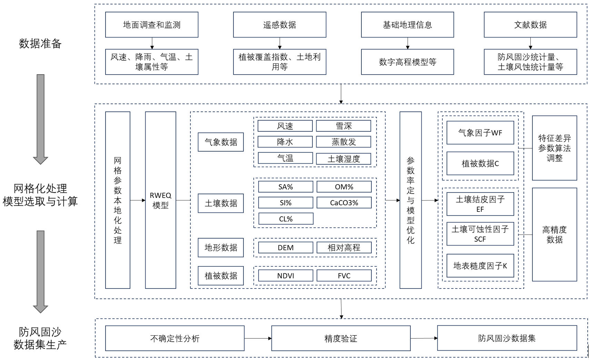
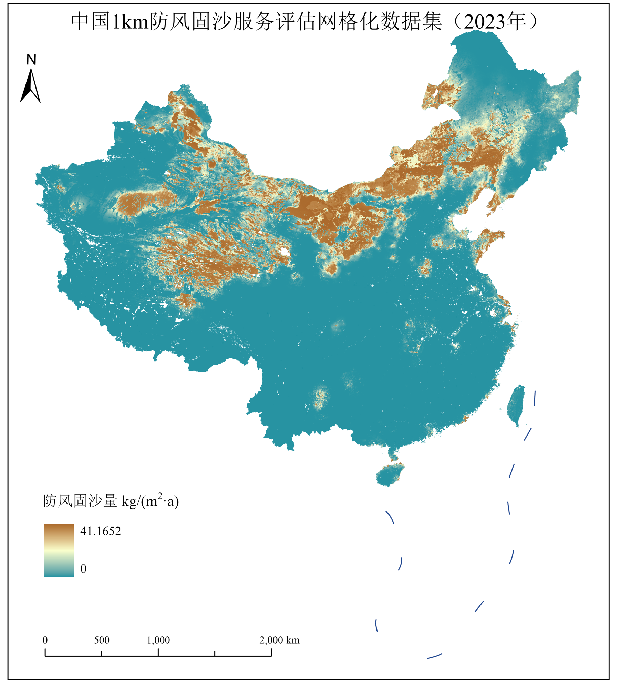

# 2023年中国1 km防风固沙服务评估网格化数据集

**中文** | [English](README_EN.md)

2023年 · 中国 · 1 km × 1 km · GeoTIFF · kg/(m²·a)

## 数据集简介

本数据集由首都师范大学胡卓玮教授课题组生产，是国家重点研发计划项目“大尺度生态质量与生态服务评估大数据智能挖掘技术和关键参数网格化平台建设应用示范”课题3（2023YFF1303703）形成的防风固沙服务评估数据产品。

数据集提供2023年中国全国尺度、1 km网格的年防风固沙量评估结果，**可以用于**全国及区域尺度防风固沙服务空间分布分析、生态系统服务综合评估，以及生态保护与修复相关研究；也可以结合研究区资料，为风蚀重点防治区识别、风沙源治理工程布局、荒漠生态保护补偿及防风固沙工程成效评估等研究提供基础数据。

## 基本信息

| 项目 | 内容 |
| --- | --- |
| 年份 | 2023年（单年度） |
| 空间范围 | 中国全国尺度；实际有效覆盖以有效像元为准 |
| 空间分辨率 | 1000 m × 1000 m |
| 变量及单位 | 年防风固沙量（单位面积），kg/(m²·a) |
| 数据格式 | GeoTIFF |
| 数据文件 | `China_Windbreak_Sand_Fixation_Service_2023_1km.tif` |
| 文件大小 | 33,142,530字节，约31.61 MiB |
| 波段 / 数据类型 | 单波段 / Float32 |
| 栅格尺寸 | 7491列 × 5775行 |
| 坐标参考系统 | WGS 84基准的自定义Albers等积圆锥投影，坐标单位为米 |
| 投影参数 | 中央经线105°；原点纬度0°；标准纬线25°、47°；东向偏移与北向偏移均为0 m |
| XY坐标系 | Albers_Conic_Equal_Area |
| NoData | `-9999` |
| 有效像元值域 | 0–41.16516876220703 kg/(m²·a) |
| 有效像元数 | 9,363,520（排除NoData） |
| 压缩方式 | LZW |
| 数据生产单位 | 首都师范大学 |
| 版本 | v1.0.0 |

完整空间信息见[元数据文件](metadata/dataset_metadata.json)和[投影WKT](metadata/crs.wkt)。统计时须显式排除`-9999`，不能仅依赖栅格内部掩膜。

## 数据获取

请在本仓库的 [**Releases**](https://github.com/giserwx/ChinaWindbreakSandFixation-1km-2023/releases) 页面下载 `China_Windbreak_Sand_Fixation_Service_2023_1km.tif` 和 `SHA256SUMS.txt`。仓库的“Download ZIP”只包含说明、元数据、配图和读取示例，不包含全国GeoTIFF。

下载后可使用 `sha256sum China_Windbreak_Sand_Fixation_Service_2023_1km.tif`（Linux/macOS）或 `Get-FileHash China_Windbreak_Sand_Fixation_Service_2023_1km.tif -Algorithm SHA256`（PowerShell）核对文件完整性。

## 技术方法

本数据集以修正风蚀方程（RWEQ）为基础，采用“月尺度计算、年度累加”的方式评估2023年全国防风固沙服务，融合ERA5再分析数据、地面气象站观测、土壤水分、土地利用及植被覆盖度（FVC）等多源数据。

1. **风速优化。** 以历史站点实测风速与ERA5风速配对数据为样本，结合站点经纬度、地形特征和土地利用类型等下垫面因子学习风速残差规律，生成2023年校正风速并开展空间化处理。
2. **土壤湿度因子优化。** 融合多分辨率土壤水分数据，表征地表水分条件对风蚀过程的抑制作用。
3. **植被因子优化。** 综合土地利用与植被覆盖数据，细化不同地表覆盖条件下植被对风蚀过程的影响。
4. **年度数据生产。** 将优化后的关键输入与参数用于RWEQ模型，通过月尺度计算与年度累加形成1 km网格的年防风固沙服务评估结果。



## 质量评估

课题组通过风速驱动方案对比和蒙特卡洛模拟开展评估，结果如下：

| 评估内容 | 结果 |
| --- | --- |
| 空间等级判别一致率 | 优化风速驱动的服务评估结果与实测风速驱动结果比较，一致率达到85%以上 |
| 像元平均变异系数（CV） | 由0.476降至0.357，相对下降24.94% |
| 区域平均服务量变异系数（CV） | 由0.308降至0.257，相对下降16.47% |

不确定性结果对应蒙特卡洛模拟设定的输入与参数扰动条件；CV及相对降幅采用课题组评估报告中的数值。

## 空间分布示意



## 读取数据

可使用支持GeoTIFF的GIS软件打开文件，或安装Python的`rasterio`和`numpy`后运行：

```bash
python scripts/read_geotiff.py /path/to/China_Windbreak_Sand_Fixation_Service_2023_1km.tif
```

## 相关研究论文

李思远, 胡卓玮, 朱振洲, 侯文星, 王咪, 刘祥平, 赵丽, 王俊杰. 土地覆被变化驱动的新疆艾比湖流域防风固沙服务与生态恢复潜力评估[J]. 自然资源遥感, 2026, 38(4): 106–117. [DOI: 10.6046/zrzyyg.2025209](https://doi.org/10.6046/zrzyyg.2025209).

## 数据使用声明

我们向科研群体提供数据产品，希望通过数据传播促进科学进步。如果您计划在论文或报告中使用本数据，请在研究早期告知我们，并确保您的研究与我们目前基于该数据产品开展的工作没有显著重叠。此外，如果本数据对您的研究至关重要，或某项重要结果或发现依赖于本数据，共同署名可能是适当的。请在论文投稿前充分提前告知您的分析和发表计划，给予我们阅读稿件并作出实质性学术贡献的机会，并在适当情况下邀请共同署名。联系人：Dr. Zhuowei Hu（huzhuowei@cnu.edu.cn）。

## 联系方式

| 联系人 | 邮箱 |
| --- | --- |
| 课题负责人：Dr. Zhuowei Hu（胡卓玮） | [huzhuowei@cnu.edu.cn](mailto:huzhuowei@cnu.edu.cn) |
| 技术联系人：Tianao Han | [2250902106@cnu.edu.cn](mailto:2250902106@cnu.edu.cn) |
